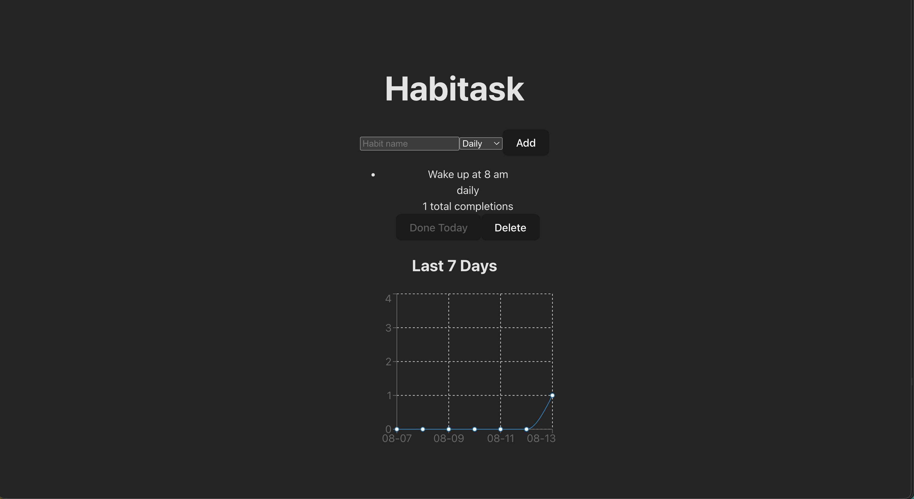

# Habitask

A minimalist, web-first habit tracker to create habits, mark daily progress, and visualize consistency.

## Demo Video


## Currently Working Features
- Habit Tracking – Add new habits with a name and frequency.
- Daily Completion – Mark habits as completed for today with one click.
- 7-Day Progress Chart – Visualize completions across the last week using Recharts.
- Habit Management – Remove unwanted habits anytime.
- Real-Time Updates – Instant UI refresh after creating, completing, or deleting.
- Persistent Data – Stores habits in MongoDB via an Express + Mongoose API.

## Tech Stack
Frontend: React, Vite, Tailwind CSS, Recharts  
Backend: Node.js, Express.js, Mongoose  
Database: MongoDB
Dev Tools: npm, Git, Vite Dev Server  

## API Endpoints

Base URL (dev): `http://localhost:4000/api`

Habit object
```json
{
  "_id": "string",
  "name": "string",
  "frequency": "daily | weekly",
  "completions": ["2025-08-13T00:00:00.000Z", "..."],
  "createdAt": "2025-08-12T18:06:37.259Z",
  "updatedAt": "2025-08-12T18:06:37.259Z"
}
```

Endpoints
- GET /habits - returns Habit[]
- POST /habits - body: { "name": "Wake up at 8am", "frequency": "daily" } - returns created Habit
- PATCH /habits/:id/complete - body optional: { "date": "YYYY-MM-DD" } — returns updated Habit
- DELETE /habits/:id - returns { "ok": true }

## Setup

### 1) Clone and install

```bash
git clone https://github.com/PrachetasKondapuram/habitask
cd habitask
```

Client
```bash
cd client
npm install
```

Server
```bash
cd ../server
npm install
```

### 2) Environment Variables

client/.env
```bash
VITE_API_URL=http://localhost:4000/api
```
server/.env
```bash
PORT=4000
MONGODB_URI=mongodb://127.0.0.1:27017/habitask
```

### 3) Run Locally

Start Backend:
```bash
cd server
npm run dev
```

Start Frontend:
```bash
cd ../client
npm run dev
```

Open http://localhost:5173 in your browser.

## Screenshots




## Known Issues / Limitations

- No authentication.
- No edit flow for renaming habits or changing frequency after creation.
- No reminders/notifications.
- Minimal UI error messages.

## Future Planned Features

- Auth & multi-user
- Categories/tags
- Notifications
- Calendar heatmap

## Contact Information

PK Kondapuram - prko@vt.edu